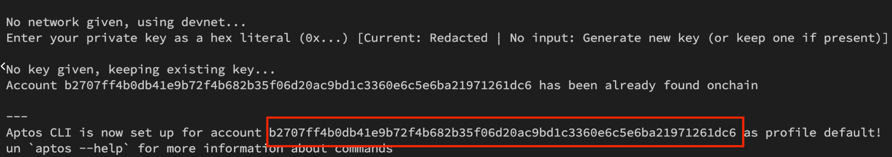

# Installation

### Install aptos CLI

Install Aptos from here **[https://aptos.dev/cli-tools/aptos-cli-tool/use-aptos-cli](https://aptos.dev/cli-tools/aptos-cli-tool/use-aptos-cli)**

### Deploy Token Staking Smart Contract

Create aptos account

```bash
aptos init
```


Copy the aptos account key and use it to publish the mokshyastaking smart contract

```bash
  aptos move publish --named-addresses mokshyastaking=0xb2707ff4b0db41e9b72f4b682b35f06d20ac9bd1c3360e6c5e6ba21971261dc6
```

Replace 0xb2707ff4b0db41e9b72f4b682b35f06d20ac9bd1c3360e6c5e6ba21971261dc6 with your account address.
