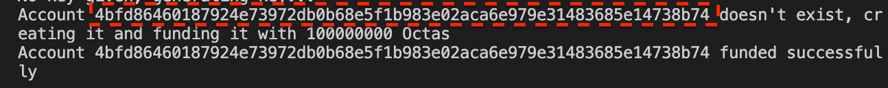

# Installation

### Install aptos CLI

Install Aptos from here **[https://aptos.dev/cli-tools/aptos-cli-tool/use-aptos-cli](https://aptos.dev/cli-tools/aptos-cli-tool/use-aptos-cli)**

### Clone Repositor

Clone Mokshya Protocols Token Vesting Smart Contract from **[https://github.com/mokshyaprotocol/aptos-token-vesting](https://github.com/mokshyaprotocol/aptos-token-vesting)**

### Deploy Token Vesting Smart Contract

Inside the aptos-token-vesting contract directory. Use following Command to create an aptos account

```bash
aptos init
```


Copy the aptos account key and use it to publish the aptos-token-vesting smart contract

```bash
 aptos move publish --named-addresses token_vesting=0x4bfd86460187924e73972db0b68e5f1b983e02aca6e979e31483685e14738b74
```

Replace 0x4bfd86460187924e73972db0b68e5f1b983e02aca6e979e31483685e14738b74 with your account address.
