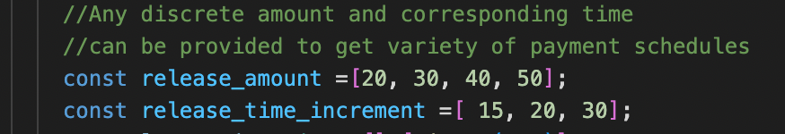

# Vesting Operations

You can go to tests/vesting.ts directory for integration testing of vesting smart contract.

First install dependencies

```bash
npm install
```

Now go to tests/vesting.ts and replace the program id

You can use variety of release amount, time increments or actual time stamps to create and schedule any form of payment.



The sender can then create the vesting as

```jsx
// create vesting for account 2
const create_vesting_payloads = {
  type: "entry_function_payload",
  function: pid + "::vesting::create_vesting",
  type_arguments: ["0x1::aptos_coin::AptosCoin"],
  arguments: [account2.address(), release_amount, release_time, 140, "xyz"],
};
let txnRequest = await client.generateTransaction(
  account1.address(),
  create_vesting_payloads
);
let bcsTxn = AptosClient.generateBCSTransaction(account1, txnRequest);
await client.submitSignedBCSTransaction(bcsTxn);
```

Similarly the receiver can release the required funds as

```jsx
//receiver can release funds as below
const create_getfunds_payloads = {
  type: "entry_function_payload",
  function: pid + "::vesting::release_fund",
  type_arguments: ["0x1::aptos_coin::AptosCoin"],
  arguments: [account1.address(), "xyz"],
};
let txnRequest = await client.generateTransaction(
  account2.address(),
  create_getfunds_payloads
);
let bcsTxn = AptosClient.generateBCSTransaction(account2, txnRequest);
await client.submitSignedBCSTransaction(bcsTxn);
```

You can run the test using the command

```bash
yarn test
```

This results the following

```
  Token Vesting
    ✔ Creating Vesting (5988ms)
    ✔ Get Funds (3376ms)
```

> Mokshya Protocol is Open Source Protocol in Aptos Blockchain. We would highly encourage developers getting involved and improving the solutions
